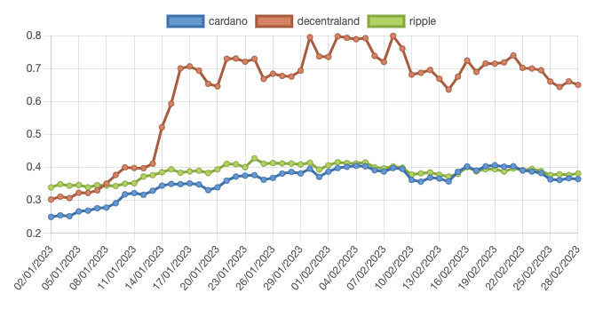

## Wordpress/Gutenberg - Crypto Chart Block  
  

### A Simple Gutenberg Block  
This is a simple Gutenberg block plugin to learn and practice Wordpress plugin development, and React. 
  

### Components
The plugin uses different Wordpress/Gutenberg React components like the TextControl, SelectControl and others

### API
The market prices came from CoinGeko free API

### TODO
- Localization
- Improve Code
- Elementor compatibility